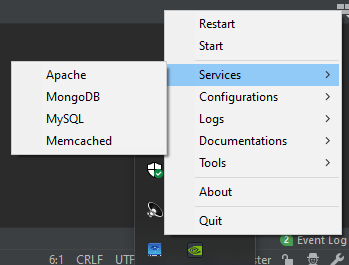

#  XWAMP 

> Zero install WAMP built with Golang.
[Download 0.1.0 now](https://github.com/romualdr/xwamp/releases/download/v0.1.0-alpha/xwamp-0.1.0-alpha.zip)

The goal of XWAMP is to provide a simple executable to run web developments tools with one click. It's packed with Apache / MySQL / PHP / Mongo and administration tools pre-configured.

Heavily inspired by the now defunct ZWAMP.

## Getting started

Grab the latest release [here](https://github.com/romualdr/xwamp/releases), unzip and run the file `xwamp.exe`.

## Where do i put my code ?

You can add your PHP files or your web application in the `vdrive\web` folder.

## Tools and versions

[Apache 2.4.41](http://httpd.apache.org/)

[MySQL 8.0.18](https://www.mysql.com/fr/products/community/) (username: root / password: password)

[MongoDB 4.2.1](https://www.mongodb.com/what-is-mongodb)

[PHP 7.4.0](https://www.php.net/) with extensions:
- [Pear 2](https://pear2.php.net/)
- [APCu 5.1.18](https://pecl.php.net/package/APCu)
- [GeoIP 1.1.1](https://pecl.php.net/package/geoip)
- [YAML 2.0.1](https://pecl.php.net/package/yaml)
- [MongoDB 1.6.1](https://pecl.php.net/package/mongodb)
- curl, gd2, openssl, pdo_mysql, pdo_sqlite, sqlite3, tidy, xmlrpc, opcache, mbstring

[Memcached 1.5.20](http://memcached.org/)

[MemCache Admin by kn007](https://github.com/kn007/memcache.php)

[Adminer 4.7.5](https://www.adminer.org/)

